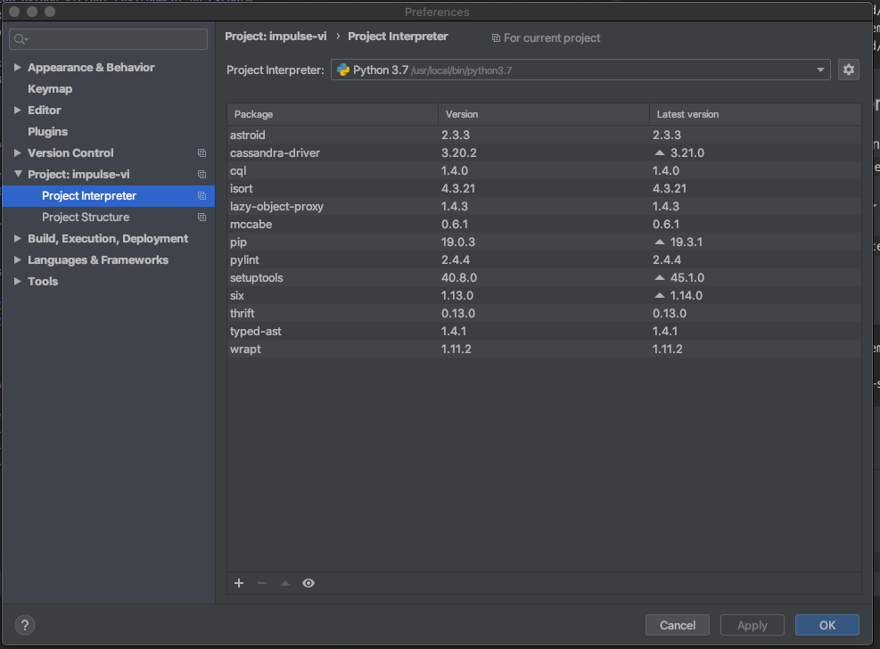
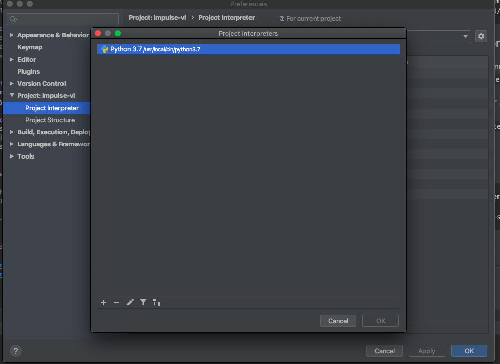
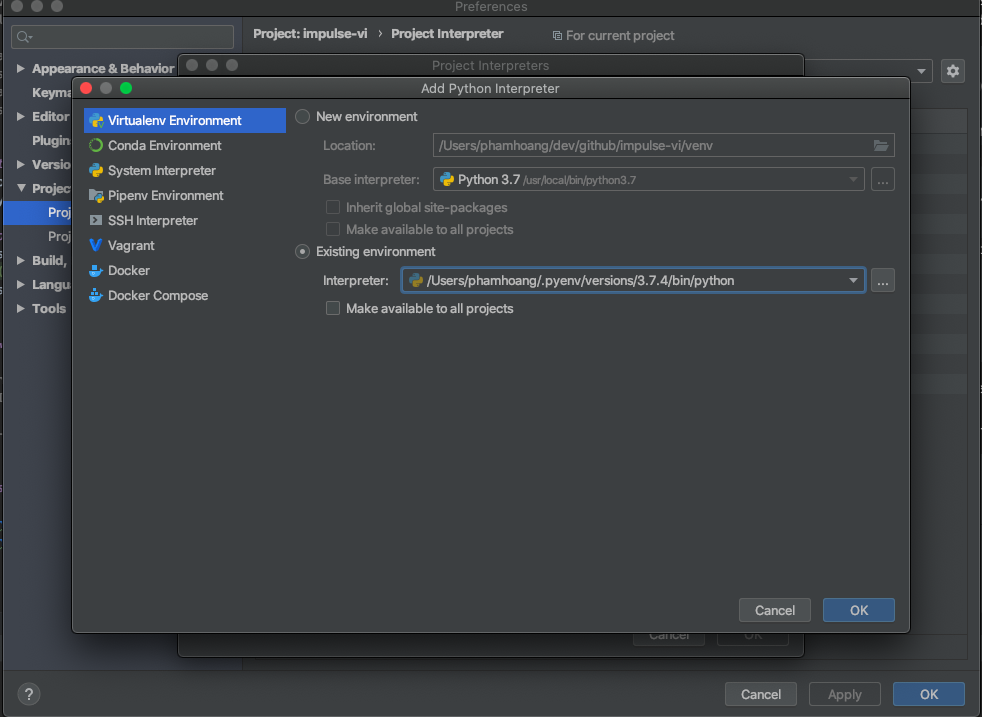

## backend

This application server is originated from [this repository](https://github.com/tiangolo/uwsgi-nginx-flask-docker).
If you want to modify directory structure or place static files then see detail explanation of [the repository](https://github.com/tiangolo/uwsgi-nginx-flask-docker).


### Setup Python Virtual Environment

Create `impulse-vi` virtual environment for this project.

```text
Notice that this project will soon become larger as it will have more than one backend service,
and each service may need a different python virtual environment to run. So the bellow configuration is set for
each specific backend module.
```

```bash
# change this to suit your env
export APPS_HOME=~/GitHub/BTI-apps-training

cd ${APPS_HOME}/backend
pyenv virtualenv 3.7.4 apps-training-env
pyenv local apps-training-env
pip install -r ${APPS_HOME}/backend/requirements.txt

```

### Setup python virtual environment on Pycharm

- If you want to use separated environment for a module, please open this module as a new project
  with Pycharm and do the `how to set project interpreter for a module` as shown bellow

#### How to set project interpreter for a module

- Press `⌘ + ,`, search `Project Interpreter`
  
- Press `Project Interpreter` and `Show all`
  
- Press `Choose existing environment` and choose your environment that you have created
  

